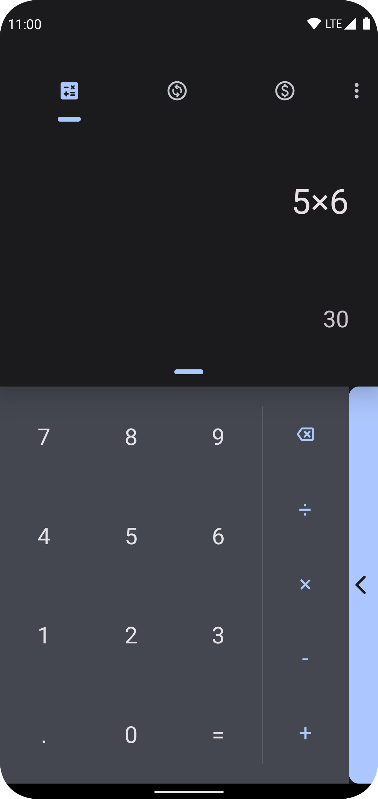
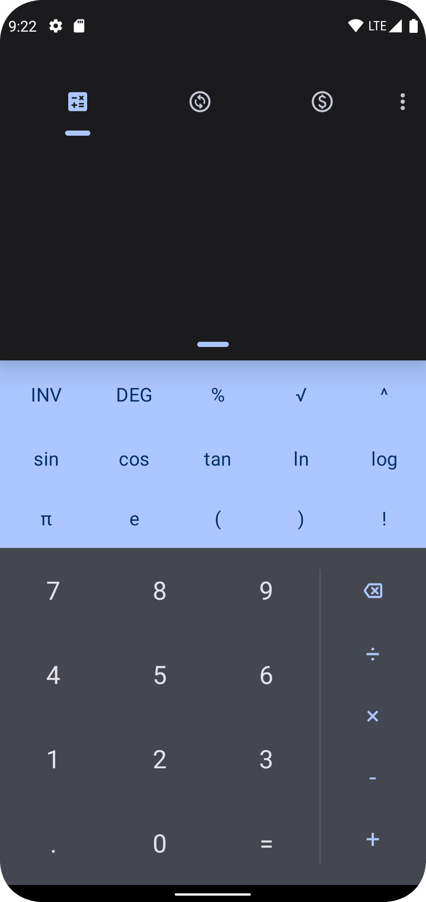
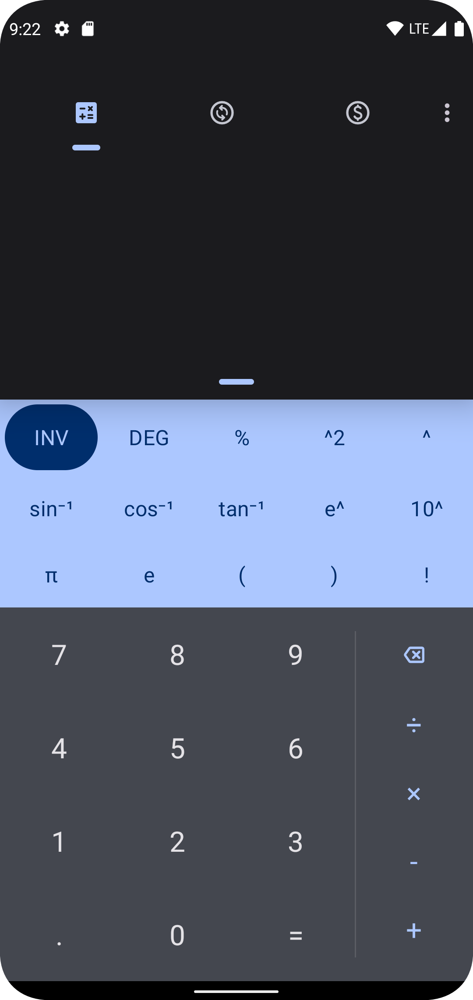
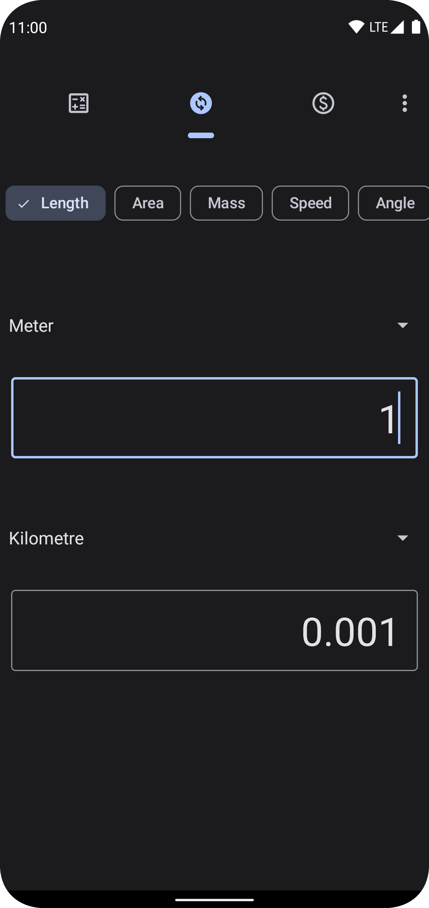
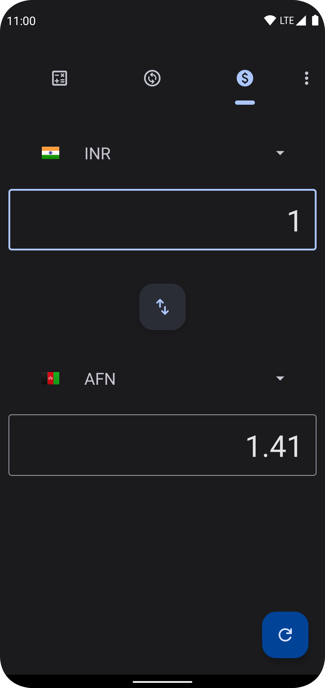
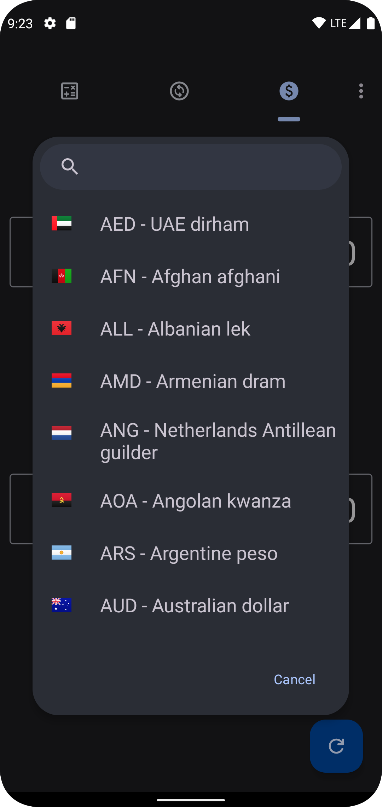
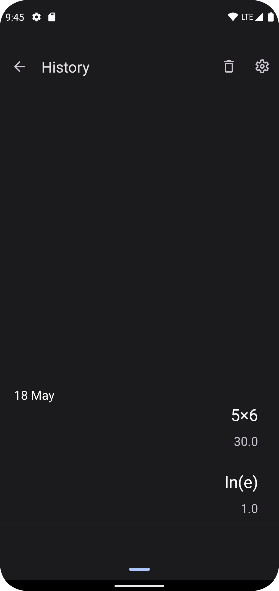

# Calculator-inator

Calculator & Converter for Android inspired from Google's Calculator App

## Features :

Basic & Advanced Calculator with logarithmic and trigonometric functions.
Length, Area, Mass, Speed, Pressure, Data, Volume, Time, Temperature, Angle 
Live Currency Converter.

## Download

or get it from the [GitHub Releases](https://github.com/prathameshmm02/Calculator-inator/releases).

## Screenshots:

    
    
    
    
    
    
    
    

